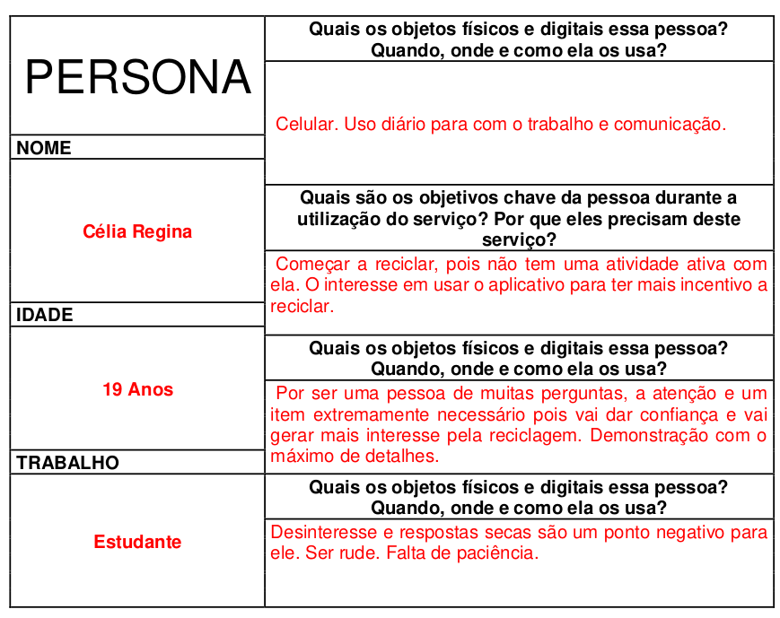

# Informações do Projeto

`Aplicação Web para Auxiliar a Cadeia de Reciclagem` 

Plataforma para conectar centros de coleta, recicladores, domicílios residenciais e pequenos estabelecimentos.

`Ciência da Computação`

## Participantes

> Os membros do grupo são: 
> - Bruno Henrique da Silva Brum
> - João Marcelo Andrade Guimarães
> - Joshua Victor
> - Mateus Gomes Pereira Silva

# Estrutura do Documento

- [Informações do Projeto](#informações-do-projeto)
  - [Participantes](#participantes)
- [Estrutura do Documento](#estrutura-do-documento)
- [Introdução](#introdução)
  - [Problema](#problema)
  - [Objetivos](#objetivos)
  - [Justificativa](#justificativa)
  - [Público-Alvo](#público-alvo)
- [Especificações do Projeto](#especificações-do-projeto)
  - [Personas e Mapas de Empatia](#personas-e-mapas-de-empatia)
  - [Histórias de Usuários](#histórias-de-usuários)
  - [Requisitos](#requisitos)
    - [Requisitos Funcionais](#requisitos-funcionais)
    - [Requisitos não Funcionais](#requisitos-não-funcionais)
  - [Restrições](#restrições)
- [Projeto de Interface](#projeto-de-interface)
  - [User Flow](#user-flow)
  - [Wireframes](#wireframes)
- [Metodologia](#metodologia)
  - [Divisão de Papéis](#divisão-de-papéis)
  - [Ferramentas](#ferramentas)
  - [Controle de Versão](#controle-de-versão)
- [**############## SPRINT 1 ACABA AQUI #############**](#-sprint-1-acaba-aqui-)
- [Projeto da Solução](#projeto-da-solução)
  - [Tecnologias Utilizadas](#tecnologias-utilizadas)
  - [Arquitetura da solução](#arquitetura-da-solução)
- [Avaliação da Aplicação](#avaliação-da-aplicação)
  - [Plano de Testes](#plano-de-testes)
  - [Ferramentas de Testes (Opcional)](#ferramentas-de-testes-opcional)
  - [Registros de Testes](#registros-de-testes)
- [Referências](#referências)

# Introdução

## Problema

Ameaçados pelo aquecimento global, a pauta ambiental tem tomado cada vez mais espaço e relevância na nossa sociedade nas últimas décadas. Diversas ações/dispositivos estão sendo desenvolvidos a fim de revisar/aprimorar os nossos processos produtivos e relações de consumo com o objetivo de tornar a nossa relação com o meio ambiente sustentável e, por consequência, frear o aquecimento global. Dentre elas, podemos destacar a chamada 3 'R's (três R), um acrônimo para reduzir, reutilizar e reciclar. 

Em suma, o 3’R’s é uma prática de consumo sustentável em que o princípio consiste em reduzir a quantidade de produtos/serviços que consumimos, reutilizarmos ou encontrar novas aplicações para eles e, ao fim, reciclarmos quando a sua vida útil chegar ao fim.

Neste contexto, de acordo com a [matéria publicada pela Empresa Brasileira de Comunicação](https://agenciabrasil.ebc.com.br/geral/noticia/2022-06/indice-de-reciclagem-no-brasil-e-de-4-diz-abrelpe), a EBC, em junho de 2022, somente 4% dos resíduos sólidos recicláveis produzidos no Brasil são reciclados, índice muito abaixo dos nossos vizinhos de América Latina, como Chile e Argentina. 

Além da desconscientização por parte dos consumidores/organizações, dentre o pequeno grupo de pessoas/organizações que se preocupam em reciclar, somente um universo ainda menor possui acesso a infraestrutura de reciclagem, seja através da coleta seletiva fornecida pelo Poder Público ou acesso a centros de reciclagem perto de suas residências.

## Objetivos

Dado tal panorama, o projeto exposto aqui busca criar uma ferramenta capaz de aproximar 3 pontas: o centro de coleta, recicladores e residências. 
Em resumo, ela será uma plataforma web que permitirá ao reciclador realizar um rota pré-definida pelo centro de coleta, atendendo a demanda residencial por reciclagem.

Com isso, o objetivo é contribuir para o aumento do volume de resíduos sólidos reciclados no Brasil, bem como oferecer um serviço conveniente de coleta de recicláveis a domicílio e aumentar o volume de recicláveis coletados pelos recicladores, aumentando assim a sua a renda.

## Justificativa

A importância e motivação da plataforma aqui proposta se dá através da necessidade dos próprios autores deste documento em reciclar, mas que não têm seus bairros atendidos pela coleta seletiva oferecida pelas prefeitura de Belo Horizonte. Junto a isso, também foi exposto a dificuldade em encontrar pontos de coleta seletiva (público ou privado) em suas regiões, assim como falta de conhecimento sobre o processo de separação e identificação dos resíduos sólidos recicláveis.

## Público-Alvo

A plataforma busca atender a necessidade, a princípio, de belo-horizontinos de microrregiões que possuem pelo menos um centro de reciclagem, mas que não contam com coleta seletiva pública. Neste universo, o objetivo é atender a demanda de domicílios residenciais e/ou pequenos estabelecimentos que desejam reciclar. Para atender esta demanda, a plataforma conta com a parceria de centros de reciclagem e recicladores, oferecendo-nos uma vantagem competitiva e financeira. Caracterizamos como recicladores como qualquer pessoa que realiza coleta de materiais recicláveis de porta-em-porta com o objetivo de vendê-lo ao centro reciclagem. O centro de reciclagem o definimos como um estabelecimento comercial ou cooperativa que realiza a compra, tratamento e venda de materiais reciclagem para terceiros.

# Especificações do Projeto

Por se tratar de um software, o desenvolvimento da plataforma aqui proposta se apoiará em metodologias e boas práticas relacionadas ao universo da Engenharia de Software. Entre elas, destacamos o Design Thinking para a idealização da plataforma, o Scrum para o processo de desenvolvimento e o User Flow para o desenho do fluxo e design dos elementos da plataforma.

## Personas e Mapas de Empatia

## Histórias de Usuários

Com base na análise das personas forma identificadas as seguintes histórias de usuários:

|EU COMO... `PERSONA`    | QUERO/PRECISO ... `FUNCIONALIDADE`          |PARA ... `MOTIVO/VALOR`                                  |
|------------------------|---------------------------------------------|---------------------------------------------------------|
|Amante da natureza      | Reciclar o máximo que puder                 | Preservar o planeta                                     |
|Humanitária             | Facilitar a vida de catadores               | Para que eles recebam e possam viver com dignidade      |
|Amante de paisagens     | Que os lixos encontrem seus devidos lugares | Melhorar a paisagem da cidade                           |
|Trabalhador sustentável | Diminuir a produção de mais materiais       | Para reduzir a exploração de florestas e outros lugares |

## Requisitos

As tabelas que se seguem apresentam os requisitos funcionais e não funcionais que detalham o escopo do projeto.

### Requisitos Funcionais

|ID    | Descrição do Requisito                                                | Prioridade |
|------|-----------------------------------------------------------------------|------------|
|RF-001| Permitir que o usuário  se cadastre e escolha seus locais             | ALTA       |
|RF-002| Verificar se as metas de cada entidade estão sendo cumpridas          | MÉDIA      |
|RF-003| Gerar um relatório mensal do material reciclado                       | MÉDIA      |
|RF-004| Acompanhar a atividade atual de uma entidade associada                | ALTA       |
|RF-005| Ter informações como quais materiais são reciclados e como prepara-lo | ALTA       |

### Requisitos não Funcionais

|ID     | Descrição do Requisito                                                |Prioridade |
|-------|-----------------------------------------------------------------------|-----------|
|RNF-001| O sistema deve ser responsivo para rodar varios tipos de dispositivos | ALTA      |
|RNF-002| Gerenciar os horários de todas as entidades cadastradas               | MÉDIA     |
|RNF-003| Deve processar requisições do usuário em no máximo 5s                 | BAIXA     | 
|RNF-004| Organizar o banco de dados da melhor forma                            | MÉDIA     | 

## Restrições

O projeto está restrito pelos itens apresentados na tabela a seguir.

|ID| Restrição                                                                       |
|--|---------------------------------------------------------------------------------|
|01| O projeto deverá ser entregue até o final do semestre                           |
|02| Não pode trazer informações sem fundamentos para mais atrapalhar do que ajudar  |

# Projeto de Interface

A interface tem que ser o mais fácil de entender, pois irá abrangir tanto pessoas escolarizadas como as não.
Os botões e informações tem de ser sucintas, para não criar duplo sentido.
Uma interface boa é aquela que, como mínimo de "aparatos", consegue informar e guiar os usuários de forma simples. Essa é a meta do projeto, facilitar a vida de todos.
Também deve abrangir o máximo de dispositivos possível, para atender a qualquer tipo de usuário.

## User Flow

O user flow ainda não foi contextulizado e por isso não há representação ainda.

> Fluxo de usuário (User Flow) é uma técnica que permite ao desenvolvedor
> mapear todo fluxo de telas do site ou app. Essa técnica funciona
> para alinhar os caminhos e as possíveis ações que o usuário pode
> fazer junto com os membros de sua equipe.
>
> **Links Úteis**:
> - [User Flow: O Quê É e Como Fazer?](https://medium.com/7bits/fluxo-de-usu%C3%A1rio-user-flow-o-que-%C3%A9-como-fazer-79d965872534)
> - [User Flow vs Site Maps](http://designr.com.br/sitemap-e-user-flow-quais-as-diferencas-e-quando-usar-cada-um/)
> - [Top 25 User Flow Tools & Templates for Smooth](https://www.mockplus.com/blog/post/user-flow-tools)
>
> **Exemplo**:
> 
> 

## Wireframes

Foi-se concretizado apenas a página inicial do site, contendo informações que serão úteis para se locomover por ele todo.

# Metodologia

Como essa é uma aplicação onde não há um cliente em primeiro plano, [o PO](#divisão-de-papéis) coleta dados da maior quantidade de pessoas possível, trazendo novas dores,
melhorias e reclamações da aplicação. Com essas informações, [o PO](#divisão-de-papéis) discute com todo o grupo os caminhos a se escolher.
[O Scrum master](#divisão-de-papéis) fica responsavel por dividir o novo trabalho e todos partem para a solução ([os Devs](#divisão-de-papéis) ficam mais responsáveis por essa parte.)
Após um tempo de desenvolvimento e teste, é feita uma nova pesquisa para sempre melhorar a aplicação.

## Divisão de Papéis

A divisão de papéis baseada na personalidade dos integrantes:

| Nome                          | Função              |Motivo |
|-------------------------------|-------------------------|---------------|
|Bruno Henrique da Silva Brum   | Dev      | Tem maior facilidade em lidar com o código do que com as pessoas                                                                     |
|João Marcelo Andrade Guimarães | SM e Dev | Como criador da ideia, é o melhor papel para poder analisar como estão as coisas e dar feedbacks positivos ou negativos. Além de participar do código.|
|Joshua Victor                  | PO e Dev | PO pelo fato de ter facilidade em lidar com o público, sendo de grande ajuda na hora de transmitir a mensagem de um lado par ao outro |
|Mateus Gomes Pereira Silva     | Dev      | Tem maior facilidade em lidar com o código do que com as pessoas                                                                      |

## Ferramentas

Como está tudo ainda no papel, não há nenhum tipo de site ou link para a hospedagem.

| Ambiente                   | Plataforma         |Link de Acesso                                                                        |
|----------------------------|--------------------|--------------------------------------------------------------------------------------|
|Processo de Design Thinking | Miro               | https://miro.com/app/board/uXjVPULmpx4=/?share_link_id=687371407420                  |
|Repositório de código       | GitHub             | https://github.com/ICEI-PUC-Minas-PMGCC-TI/tiaw-pmg-cc-m-20222-9-reciclagem.git      |
|Protótipo Interativo        | Figma              | https://www.figma.com/file/R7p3EZZ1kIlyx6xU8xLgAT/reciclagem-wireframe?node-id=0%3A1 |
|Comunicação por texto       | WhatsAPP           | ****                                                                                 |
|Comunicação por voz         | Discord            | ****                                                                                 |
|Editor de código            | Visual Studio Code | ****                                                                                 |

## Controle de Versão

Como está tudo ainda no papel, não há nenhum tipo de versão do código.

> Discuta como a configuração do projeto foi feita na ferramenta de
> versionamento escolhida. Exponha como a gerência de tags, merges,
> commits e branchs é realizada. Discuta como a gerência de issues foi
> realizada.
> A ferramenta de controle de versão adotada no projeto foi o
> [Git](https://git-scm.com/), sendo que o [Github](https://github.com)
> foi utilizado para hospedagem do repositório `upstream`.
> 
> O projeto segue a seguinte convenção para o nome de branchs:
> 
> - `master`: versão estável já testada do software
> - `unstable`: versão já testada do software, porém instável
> - `testing`: versão em testes do software
> - `dev`: versão de desenvolvimento do software
> 
> Quanto à gerência de issues, o projeto adota a seguinte convenção para
> etiquetas:
> 
> - `bugfix`: uma funcionalidade encontra-se com problemas
> - `enhancement`: uma funcionalidade precisa ser melhorada
> - `feature`: uma nova funcionalidade precisa ser introduzida
>
> **Links Úteis**:
> - [Tutorial GitHub](https://guides.github.com/activities/hello-world/)
> - [Git e Github](https://www.youtube.com/playlist?list=PLHz_AreHm4dm7ZULPAmadvNhH6vk9oNZA)
> - [5 Git Workflows & Branching Strategy to deliver better code](https://zepel.io/blog/5-git-workflows-to-improve-development/)
>
> **Exemplo - GitHub Feature Branch Workflow**:
>
> 

# **############## SPRINT 1 ACABA AQUI #############**

# Projeto da Solução

......  COLOQUE AQUI O SEU TEXTO ......

## Tecnologias Utilizadas

......  COLOQUE AQUI O SEU TEXTO ......

> Descreva aqui qual(is) tecnologias você vai usar para resolver o seu
> problema, ou seja, implementar a sua solução. Liste todas as
> tecnologias envolvidas, linguagens a serem utilizadas, serviços web,
> frameworks, bibliotecas, IDEs de desenvolvimento, e ferramentas.
> Apresente também uma figura explicando como as tecnologias estão
> relacionadas ou como uma interação do usuário com o sistema vai ser
> conduzida, por onde ela passa até retornar uma resposta ao usuário.
> 
> Inclua os diagramas de User Flow, esboços criados pelo grupo
> (stoyboards), além dos protótipos de telas (wireframes). Descreva cada
> item textualmente comentando e complementando o que está apresentado
> nas imagens.

## Arquitetura da solução

......  COLOQUE AQUI O SEU TEXTO E O DIAGRAMA DE ARQUITETURA .......

> Inclua um diagrama da solução e descreva os módulos e as tecnologias
> que fazem parte da solução. Discorra sobre o diagrama.
> 
> **Exemplo do diagrama de Arquitetura**:
> 
> 

# Avaliação da Aplicação

......  COLOQUE AQUI O SEU TEXTO ......

> Apresente os cenários de testes utilizados na realização dos testes da
> sua aplicação. Escolha cenários de testes que demonstrem os requisitos
> sendo satisfeitos.

## Plano de Testes

......  COLOQUE AQUI O SEU TEXTO ......

> Enumere quais cenários de testes foram selecionados para teste. Neste
> tópico o grupo deve detalhar quais funcionalidades avaliadas, o grupo
> de usuários que foi escolhido para participar do teste e as
> ferramentas utilizadas.
> 
> **Links Úteis**:
> - [IBM - Criação e Geração de Planos de Teste](https://www.ibm.com/developerworks/br/local/rational/criacao_geracao_planos_testes_software/index.html)
> - [Práticas e Técnicas de Testes Ágeis](http://assiste.serpro.gov.br/serproagil/Apresenta/slides.pdf)
> -  [Teste de Software: Conceitos e tipos de testes](https://blog.onedaytesting.com.br/teste-de-software/)

## Ferramentas de Testes (Opcional)

......  COLOQUE AQUI O SEU TEXTO ......

> Comente sobre as ferramentas de testes utilizadas.
> 
> **Links Úteis**:
> - [Ferramentas de Test para Java Script](https://geekflare.com/javascript-unit-testing/)
> - [UX Tools](https://uxdesign.cc/ux-user-research-and-user-testing-tools-2d339d379dc7)

## Registros de Testes

......  COLOQUE AQUI O SEU TEXTO ......

> Discorra sobre os resultados do teste. Ressaltando pontos fortes e
> fracos identificados na solução. Comente como o grupo pretende atacar
> esses pontos nas próximas iterações. Apresente as falhas detectadas e
> as melhorias geradas a partir dos resultados obtidos nos testes.

# Referências

......  COLOQUE AQUI O SEU TEXTO ......

> Inclua todas as referências (livros, artigos, sites, etc) utilizados
> no desenvolvimento do trabalho.
> 
> **Links Úteis**:
> - [Formato ABNT](https://www.normastecnicas.com/abnt/trabalhos-academicos/referencias/)
> - [Referências Bibliográficas da ABNT](https://comunidade.rockcontent.com/referencia-bibliografica-abnt/)
